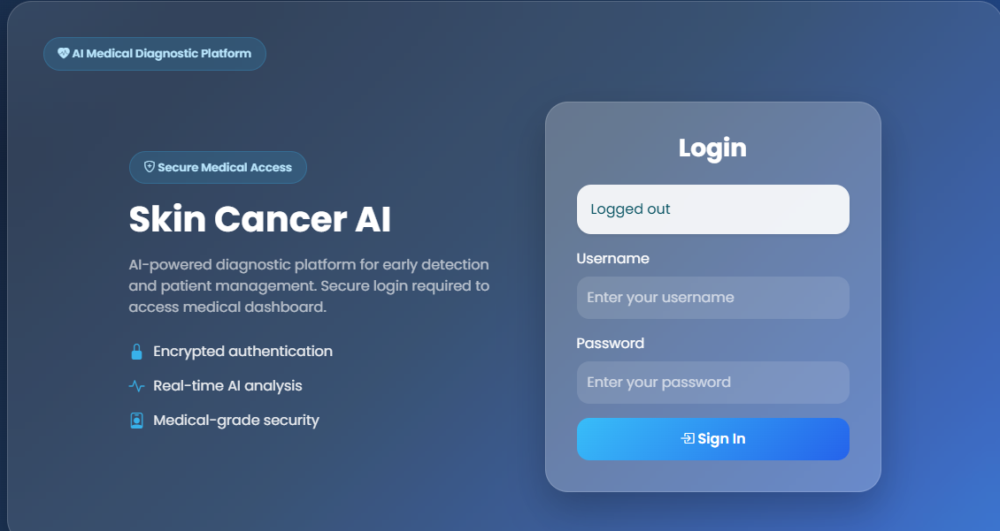
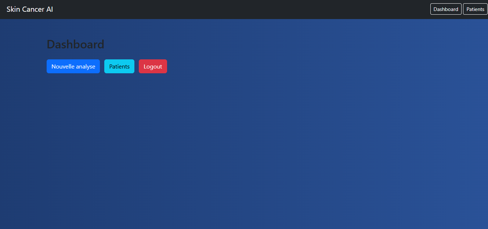
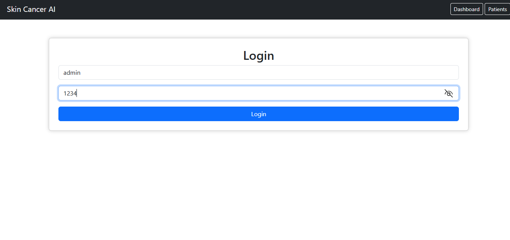
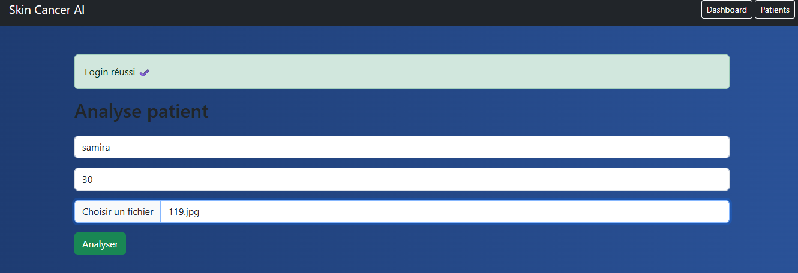
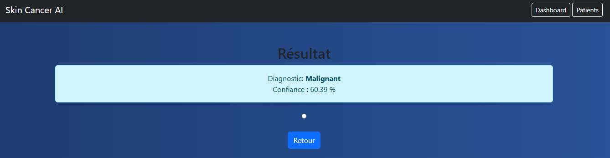
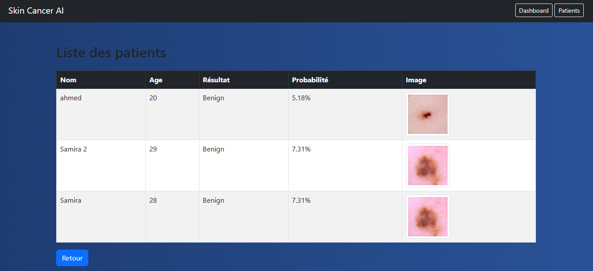

# Application Web de Détection du Cancer de la Peau par Intelligence Artificielle

## Description

Cette application web permet de détecter automatiquement la présence potentielle d'un cancer de la peau à partir d'une image dermatologique grâce à un modèle d'intelligence artificielle basé sur le Deep Learning.

Le système utilise un modèle CNN pré-entraîné **VGG16** afin de classifier les lésions cutanées en deux catégories :

- ✅ Benign (bénigne)
- ⚠️ Malignant (maligne)

L'application offre également :

- une authentification utilisateur,
- l'enregistrement des patients,
- le stockage des résultats d'analyse,
- l'affichage de l'historique des patients.

---

# Technologies Utilisées

## Backend
- Python / Flask

## Intelligence Artificielle
- TensorFlow / Keras — VGG16 — NumPy

## Frontend
- HTML5 / CSS3 / Bootstrap

## Base de Données
- MySQL (XAMPP / phpMyAdmin)

---

# Structure du Projet

```
project/
│
├── app.py
├── requirements.txt
├── README.md
│
├── model/
│   └── vgg16_skin_cancer.keras
│
├── static/
│   └── uploads/
│
├── templates/
│   ├── login.html
│   ├── dashboard.html
│   ├── predict.html
│   ├── results.html
│   └── patients.html
│
└── database/
```

---

## Captures d'écran

### Page de connexion


### Page d'accueil


### Connexion avec identifiants


### Exemple patient


### Résultat diagnostic


### Liste des patients

